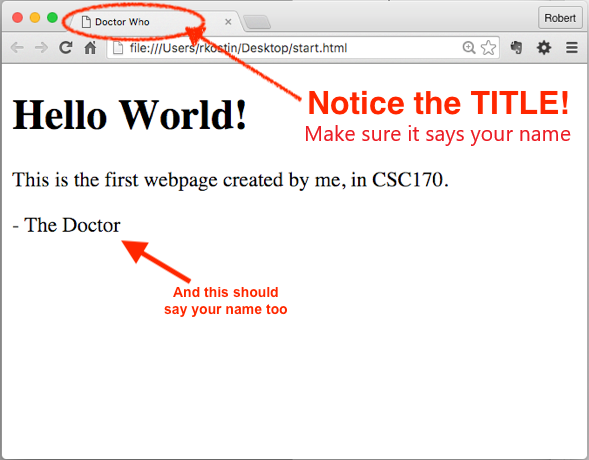

# Lab 1: Account Setup
*Due: Thursday, February 4, 2021* 

Your assignment is to login and use your account on our class web server and practice the steps to create and upload files to the World Wide Web.

## Step 1: Get an FTP account

Your **FTP (File Transfer Protocol) account** is what you will use to copy your web files from your computer to the class web server throughout the semester.  To get your account, you will contact your TA via DM in Slack to get it setup.

- Refer to [this list (linked here)](student-ta.md) to figure out **who is your TA**.
- Send the following information via DM in Slack to your TA:
  - Your **UR username** (e.g. rkostin) and a new/made-up **password**
  - Do *not* share your usual/favorite password with your TA! Create a new password that isn't used anywhere else

- Watch Slack; your TA will reply to your DM with **your FTP login information** that you'll need to keep handy for the rest of the semester
  - NOTE: your password may be different than the one you provided!  The system we're using requires a "strong" password.  If the password you provided isn't strong enough your TA will add characters to it to make it stronger.  

*Your TA will probably not get back to you immediately with your FTP information.  So in the meantime, you may proceed to Step 2 while you wait...*

## Step 2: Create a simple webpage and view it in a web browser

On your desktop or anywhere in your computer’s file system where you plan to keep your CSC 170 lab assignment files, create a new HTML file.

*NOTE: before proceeding, make sure your computer's operating system is showing "file extensions."  If you don't know what that is or how to turn them on, ask about it in the #help channel in Slack.*

Create your first HTML file...

- On a PC
  - Right mouse-click anywhere on the desktop and select “New” and then “Text Document”
  - Change the full name of the document from New Text Document.txt (including the extension) to: **start.html**
  - Click Yes to the warning dialog that pops-up.
  - Using a code editor (like [Sublime Text](https://www.sublimetext.com/3)), open the **start.html** file.
    - NOTE: if you have a preference, you can use whatever code editor you like; the professor will be using Sublime Text during demos.
- On a Mac
  - Open a code editor (like [Sublime Text](https://www.sublimetext.com/3))
    - NOTE: if you have a preference, you can use whatever code editor you like; the professor will be using Sublime Text during demos.
  - Save the current (empty) file to the desktop using the filename: **start.html**
- In your code editor, enter the following text exactly as shown in the code-box below
  - Mimic the indentations using tabs or spaces (it doesn’t matter which you use - just try to line-up the text as shown)
  - Where it says “Enter Your Name” (in two places), enter *your* name
  - Note: the "h1" is the letter "h" and the number "1", not a lowercase L
  - Also note: you need ALL the code below, starting with the `<!doctype...` thing at the top...

```html
<!doctype html>

<html>

	<head>
		<meta charset="utf-8">
		<title>Enter Your Name</title>
	</head>

	<body>
		<h1>Hello World!</h1>
		<p>This is the first webpage created by me, in CSC 170.</p>
		<p>- Enter Your Name</p>
	</body>

</html>
```

- Save the file  
- Open the **start.html** file in a web browser (double click it).  You should see something like this...<br>

If there are problems, check your handiwork for mistakes in the code editor.  Then re-save and refresh the web browser.

If it all looks good, close the code editor and web browser before continuing.

## Step 3: Access your FTP account using FTP Software

You will copy your **start.html** file from your computer to the class web server by "FTP-ing" it using software that must be installed on your computer.  There are lots of kinds of FTP software you can use.  If you already know about this and have your own preference, you can use it.  Else, if it doesn't matter:

- Use **WinSCP** for Windows
- Use **Cyberduck** for Mac

To install your own: **WinSCP** (Windows only) go to [winscp.net/eng/download.php](http://winscp.net/eng/download.php)<br>...then click the green button, “DOWNLOAD WINSCP...”

To install **Cyberduck** go to: [cyberduck.io](http://cyberduck.io)<br>
...then click “Download,” for Windows or OS X

- Use your FTP software to login to your account using the FTP credentials provided to you by your TA

If you were successful, your FTP client will connect you to the file space on the web server where you will put your web files.  Any files in that space will be accessible on the Web.

## Step 4: Upload and check your HTML document

- In the file system of your computer (e.g. on the Desktop - or wherever you're working), find your **start.html** file into and drag it the open FTP window to upload it to your account on the web server.

- Open a web browser and go to this web address, below, where “*username*” is the username that you created in Step 1 (example: **rkostin** -- *not* your FTP login with the @...)

   `www.csc170.org/username/start.html`

If you did everything correctly, you should see your simple webpage with your name on it. 

## Step 5: Log your work in Blackboard
In our CSC 170 area in **Blackboard**, in the Lab 1 assignment, create a submission where you will post *a link* to your webpage (not the actual file) to receive credit for this Lab.  

- Click the "Write Submission" button then paste your link in the box that appears. (Do not upload the HTML file to Blackboard.)
