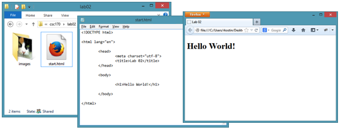
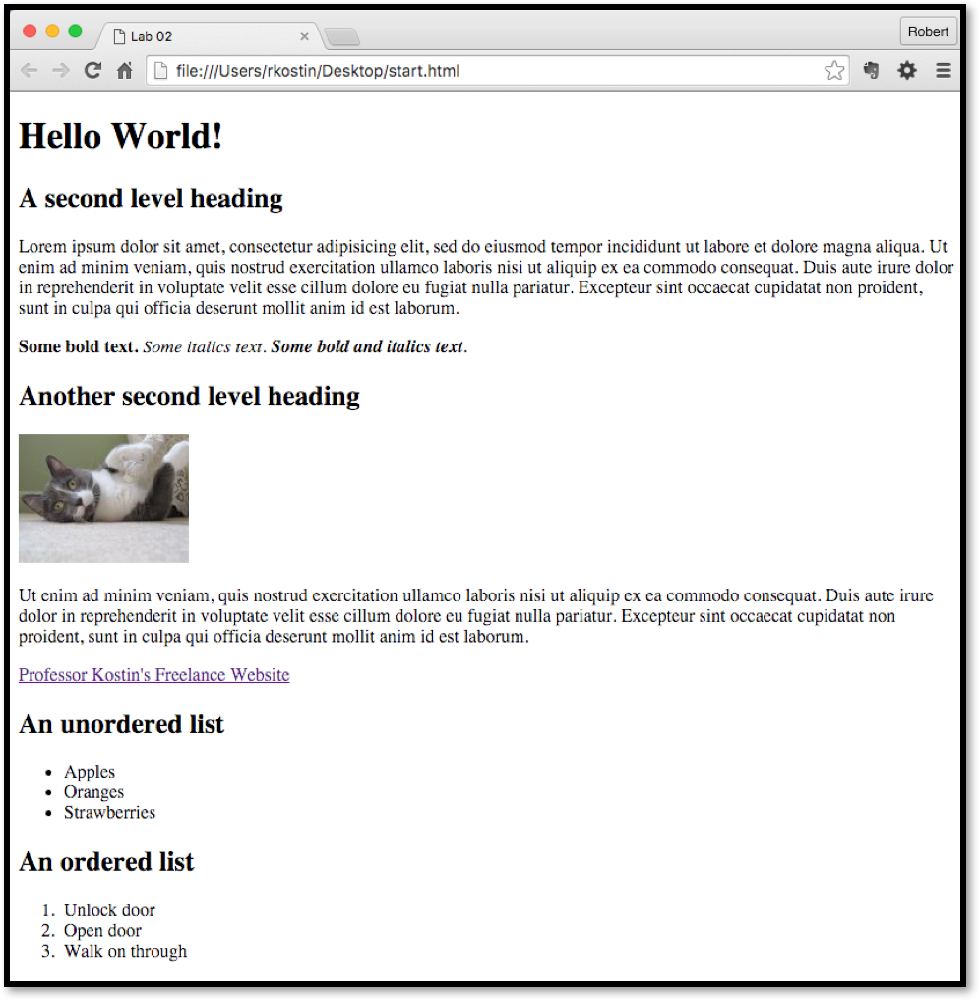

# Lab 2: First HTML Webpage
*Due: Thursday, February 11, 2021*

The purpose of this assignment is to practice writing basic HTML.

In this assignment, you will create a new HTML file and load it with “dummy” content.  Then you will markup the content with HTML tags.  And finally, you will upload the HTML file to your account on the web server.

You will need to remember your FTP account information from Lab 1.

## Step 1: Create a new HTML file

- On your desktop (or anywhere on your computer's file system) create a folder titled: **lab02**
- Inside the **lab02** folder, create a folder titled **images**
- Inside the **lab02** folder (not the **images** folder) create a new HTML file named **start.html**
- Into your code editor, copy the following code exactly:

```html
<!doctype html>

<html lang="en">

	<head>
		<meta charset="utf-8">
		<title>Lab 02</title>
	</head>

	<body>


	</body>

</html>
```
- Save your file – and generally speaking, save often!

## Step 2:  Add content to your web page

For this assignment, you can use the "comp" provided (see last page of this document) as a guide to gather some “Lorem Ipsum” text and a “FPO” images.  **It doesn’t really matter if your webpage looks exactly like the comp.  You only need to use it as a guide.**  (In fact, it’d be better if you experimented with some different content to get a feel for how it works.)

### Prep: Gather some placeholder content

- Get some placeholder text (a.k.a dummy text or lorem ipsum) and keep it handy. 

- Get an FPO image (FPO stands for *For Position Only*); for our purposes, you need a small image, **no wider than say 300 pixels** or so, and the file type must be: *jpg*, *png* or *gif*. 

### Start filling your HTML file with content

Using the *comp* at the end of this document as a guide, you will write and paste text into your open HTML file (in your code editor) inside the one `<body>` tag in the HTML.

Your goal is to make it look like (but it doesn’t have to be exactly) like the *comp*.

- Write or copy & paste plain text into your HTML document between the `<body>` tags.  You can start by typing something like this between the `<body>` tags:

  ```html
  <h1>Hello World!</h1>
  ```
  
  Be sure you indent the H1 within the open/close BODY tags.  
  
- Save your HTML file, toggle back to your lab02 folder and double click your start.html file.  The file will open in a web browser – whatever is the default web browser for your computer.  There, you should see something like this:

  

For the rest of this section, you will continue to write or copy & paste text into your HTML document, always between the one set of `<body>` tags.  (You can use any bits and pieces of the placeholder text – the *lorem ipsum* stuff – where ever you want.)  As you go, you will need to add “markup” (the tags) to the content.

- Format the plain text in your document using HTML tags. Make sure you use at least one example of each of the following types of tags.<br>*WARNING: yes! – you must look-up how to use these tags correctly...*

  - **First level heading**
  - **Second level heading**
  - **Paragraph**
  - **Bold** (strong)<br>Note: do not *ever* use the `<b>` tag
  - **Italic** (emphasis)<br>Note: do not *ever* use the `<i>` tag
  - A **link** to an inline image<br>hint: your “src” will be something like `images/cat.jpg`<br>hint: you will also need to create an "alt", something like `my cat`<br>hint: do **not** use a `height=""` or `width=""` attribute on your image tag<br>*Even though w3schools.com shows an example of an IMG element that uses the **height** and **width** attributes, do NOT use them!  (To be explained in a future lecture.)*
  - A **hyperlink** to another website<br>(hint: your “href” will be something like `http://www.google.com`)
  - An **unordered list**
  - An **ordered list**
  - An HTML **comment** (note: you will not see the comment in the web browser)

- As you write your code.  Use lots of *white space* in the code! Make sure you indent and space your HTML tags appropriately to make it easy to read the code.  

In general, the process is to write some code in the code editor, save it, then toggle to your web browser and refresh the browser.  You will see your edits in the web browser and you will figure out what you need to do next.  Then, you then toggle back to your code editor and start the process over.

## Step 3:  Upload your work
When you are done with your webpage, use your FTP software to access your account on **csc170.org**  (remember your FTP login information?) and upload your files:

1.	Open the FTP software and login to your account using the login credentials you used in Lab 1.
2.	Drag your **lab02** folder into the online area in your FTP tool.  The result will put all your files and folders on the server.
3.	In a web browser (any), go to this address to check your handiwork: 
4.	```www.csc170.org/accountname/lab02/start.html```<br>(where *accountname* is your account name)

## Step 4:  Report your work
1.	In our CSC 170 section in Blackboard, in **Lab 2: First HTML Webpage**, post a link to your webpage to receive credit for this lab assignment


[end of lab instructions]

<hr>

## Comp
Below is a *comp* to guide the design of your webpage.

Remember: it is *not* important to make your webpage look like this.  In fact, this is a good time to do some experimentation.  


