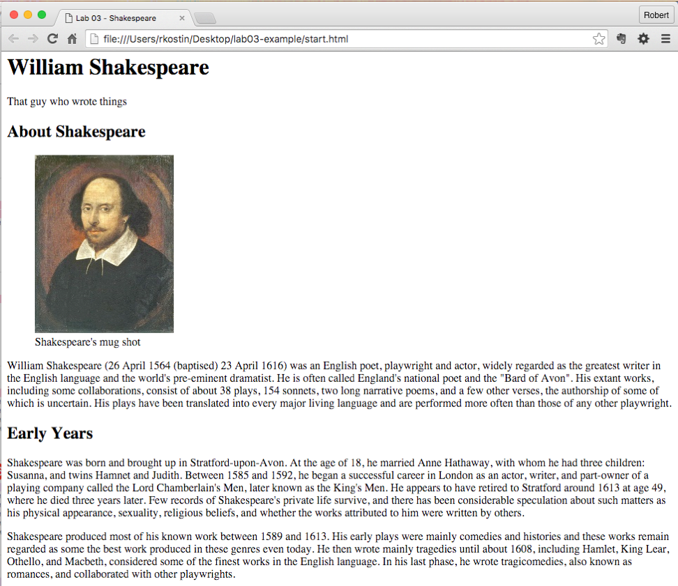
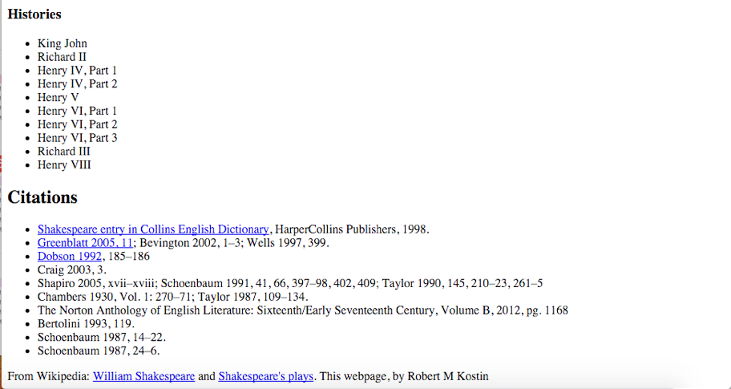

# Lab 4: Structured HTML Document
*Due: Wednesday, June 2, 2021*

This assignment builds on your ability to take "real" content (from lab 3) and mark it up using semantically correct HTML. You will use the content you prepared and fulfill the requirements as described below.

## Step 1. Setup your Work Environment

- Create a folder named **lab04** and inside it create a folder named **images**
- In the **lab04** folder, create a new HTML document named **start.html**
- Inside the **start.html** file, setup a new HTML5 template.
- In addition to the usual HTML5 template, inside the **BODY** tags, create a set of tags that will be used as your structure. 
  - You must use the following tags in your HTML document:  **HEADER, ARTICLE, ASIDE, and FOOTER** ...exactly those, in that order.

 NOTE: the four elements above, HEADER, ARTICLE, ASIDE, and FOOTER will contain *all* your content.  When you're done, there should be nothing in-between those four elements.

## Step 2. Load your Content in the HTML Document

*This is the point of this lab*: **You must semantically tag your content to identify each part of content** WITHIN the prescribed structure (header, article, aside, and footer).

Using your content from Lab 3, extract the text and images and fill the structure as follows:

-  In the **TITLE** tag in the HEAD, set the title to: "Lab 4 - *your content subject here*" Where *your content subject here* comes from your Wikipedia title, .e.g. Shakespeare
-  In the **HEADER**, use one **H1** for the name of the topic you selected from Lab 3
-  Also in the **HEADER**, create a subtitle (there is no `<subtitle>` tag, so use a **DIV**)
-  Your first three second-level headings (**H2**s) and their associated paragraphs go in the **ARTICLE**
-  The forth second-level heading (another **H2**) with the lists (and associated paragraphs, if any), go in the **ASIDE**
-  The last two headings (two more **H2**s), along with their text go in the **FOOTER**, coded appropriately
    -   Note: the "list" of citations is a *list* ...code it as an <u>un</u>ordered list with anchor tags
    -   The reference to the source of your content can go in a **P** (if you write it as a paragraph), or a **UL** if you have more than one source and want to show them in a list
        -   Remember: you cannot use a **P** tag for anything but a true paragraph.
        -   Hint: if you have some text that's not a paragraph and not anything else (like a header) then use a **DIV**.
    -   Remember: when coding hypertext (anchor tags), do not display URLs to the user in the text (between the opening and closing A tags).  
        -   `<a href="http://google.com">http://google.com</a>` ...this would be incorrect!  Instead, use regular words to *describe* the link.  
        -   `<a href="http://google.com">Google's Search Engine</a>` ...this would be correct.
    -   Remember: whenever creating a link to a resource on a *different* server on the Internet, use the `target="_blank"` attribute in the anchor tags, so they open in a new tab when the user clicks them.
-  In the **ARTICLE**, along with your H2s and paragraphs, insert your images
    -   Code the images using the **IMG** tag
    -   Note: the best position in your HTML document for your images is right after an **H2** and before the next **P** (you'll see why when we start adding styles later)
    -   Wrap each **IMG** element in a **FIGURE** element (You might want to Google "HTML figure" and "HTML figcaption" to see what they're all about)
    -   Inside the **FIGURE** element along with the **IMG** you must include a **FIGCAPTION** element in which you'll write your caption for the image (You can make up the captions that will go with each image - just a couple of words that describe the image)
-  Required: markup some of the other content in the document using the **STRONG** tag and **EM** tag, but make sure you use them for *semantic* reasons - NOT just to make things bold or italic.   Also use other HTML tags as need.  (Again, for *semantic* reasons only!)

IMPORTANT: make sure there is *no* content between the structural tags (the **HEADER**, **ARTICLE**, **ASIDE**, and **FOOTER**).  All content must be *inside* those four structural elements.

Remember: the HTML document MUST remain “semantically pure.”  Use tags for the purpose for which they were invented only!  

- No tags just to push content around! That means no **BR**, **HR** or extraneous **P** tags anywhere, and definitely no **B** or **I** tags.

- You can use **STRONG** and **EM** tags, but do not add them just to make things bold or italics.  Only use them when you have something that is "strong" or needs to be "emphasized".

  - "Strong" means *important*

  - "Emphasis" means ...well, *emphasized*

- Take a look at the [EXAMPLE](#example) at the end of this document. When you’re done, you should have a document that kinda looks like that but with different content.

## Step 3. Upload your work
When you are done with your webpage, use FTP to access your account on **csc170.org** and upload your files into a new folder named **lab04**

In a web browser (any), go to this address to check your handiwork:  
**www.csc170.org/accountname/lab04/start.html** (where “*accountname*” is your account name)

Remember: All files and folder names must always be all lowercase and no spaces.

## Step 4. Report your work

Remember: Use the W3C validator ([validator.w3.org](https://validator.w3.org)) to check your work before you report it!

-   In our Blackboard section, in Lab 04, create a new submission and post a link to your webpage to receive credit for this Lab.

## Example

NOTE: Do *not* use Shakespeare for your Lab 4!
*Also note that this example is too short - doesn't have enough content! ...you should use all the content as required from Lab 3*

