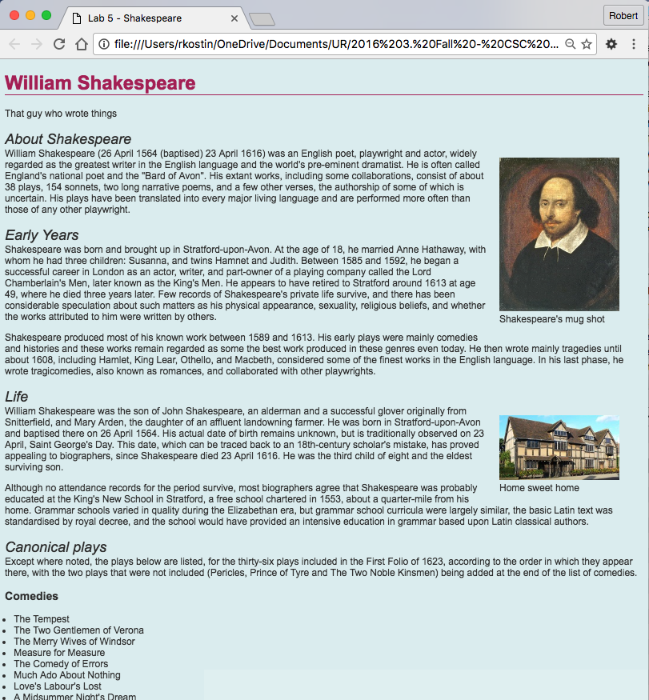

# Lab 5: CSS for Formatting, Part 1

*Due: Friday, June 4, 2021 (today!)*

In this assignment you simply need to follow the instructions to add pre-defined styles to your HTML document.  You may have to lookup the syntax on how to write the CSS code, but the styles you need to use are all defined in the instructions below.

*Please continue to curb your enthusiasm for creativity!  The **next** lab (Lab 6) will let you unleash some of that creativity. But for now, just follow the instructions.*

## Step 1: Make a copy of Lab 4

- After you’ve completed Lab 4 make a copy of all the files in it to a new folder named **lab05**
- If you haven't had Lab 4 graded yet, or you didn't get 100% on it, mistakes from Lab 4 will carry forward and you *may* lose points on Lab 5 because of it.  You may carry-on with Lab 5, but just be aware of that.
- In your new **lab05** folder, create a new folder named **css**

## Step 2: Link a CSS file

- In your **css** folder, in the same way you originally created your original HTML file (a *plain text* file), create a new plain text file and name it: **styles.css** (Make sure your new **styles.css** file is in the new **css** folder)

- Edit the Lab 5 HTML document (**start.html**). In the `<head>` of that document, create a `<link>` to the CSS file that you created in the **css** folder. 
  - Typically, the `<link>` tag goes under the `<meta>` and `<title>` tags, but technically, it’ll work anywhere.

## Step 3: Write some CSS – test the connection

- Open the file: **styles.css** in your code editor and write some simple CSS to test the link between your HTML document and your CSS file:

  1. In your CSS file add some simple code like this: `body { color: red; }`

  2. Save your CSS file.

  3. Toggle over to your web browser (which should have your HTML file loaded in it), and refresh the browser.

  4. If the text in your web page turned red, then you’re good to go! If not, you need to figure out what went wrong before proceeding.

When you’re done with this step delete the `body { color: red; }` code from your CSS file and re-save it as an empty file before proceeding.

## Step 4: Add styles to your HTML document using CSS

For the rest of this section, you will write CSS code into your CSS document.
For each instruction to find out how to code it, Google: **CSS ______________**  e.g. “CSS background color” to find some examples.

Remember the syntax for CSS:

- The selector (like `body`) followed by curly braces (`{` and `}`)

- Inside the curly braces are the declarations; remember, if there are multiple declarations for a single target, group them using the code-style demonstrated in the last lecture

- Each declaration property ends with a colon (`: `)

- Each declaration value ends with a semi-colon (`;`)

*Start writing CSS!*

- [ ] As you write CSS code, use lots of **white space**! Make sure you indent and space your CSS selectors and declarations appropriately to make it easy to read the code.
- [ ] Give the entire web page the following set of **default styles**  (Hint: to create *default styles* for a webpage use the `body {}` selector in your CSS file to set styles that will “cascade” throughout the document); the following styles are required:

  - **Background color** of `#DFEFF0` 

  - Text **color** of `#333333` 

  - **Font family** of: `Arial, Helvetica, sans-serif`
- [ ] All **first level headings** should be styled like this: 

  - Text **color** of `#AD235D`

  - A border underneath the first level heading so it has a **bottom border** that is one **1px** , **solid** and **color**ed: `#AD235D`
- [ ] All second level headings should be styled like this:

  - A **font style** of italic

  - A **font weight** of normal (i.e., not the default which is bold)

  - No **margin** (i.e. `0px`) along their **bottom** side <u>only</u>
- [ ] All paragraphs should have

  - No **margin** (i.e. `0px`) along their **top** side <u>only</u>

  - A **line height** of `1.5em`
- [ ] Set the lists (**ol** and **ul**) so they have `12px` of **padding** on their **left**
  - Note: write the style for both OL and UL regardless of whether you actually used them in your HTML document
- [ ] Set all the **figure** elements in your document so they **float** to the **right**
- [ ] Also set the **figure** elements so they have **20px** of **margin** on their **left**
- [ ] Change the way the **hyperlinks** (`a` tags) are displayed. Set their color to: `#7D9C9E`
- [ ] Also remove the underline (the **text decoration**) from all hyperlinks (set them to `none`)
- [ ] And finally, there’s a way to get the “hover” of your anchor tags to change too, so when you hover your mouse over a link, it can do something.

  - Add this selector to your CSS:
     `a:hover { color: #AD235E; }`
     (The "`:`" after the `a` is called a pseudo selector. We'll talk about that in the next lecture.)

## Step 5: Upload your work

When you are done with your webpage, use an FTP tool to access your account on **csc170.org** and upload your files into a new folder named **lab05**

In a web browser (any), go to this address to check your handiwork:  
**www.csc170.org/accountname/lab05/start.html** (where “*accountname*” is your account name)

Remember: All files and folder names must always be all lowercase and no spaces.

## Step 6: Report your work

Remember: Use the W3C HTML validator (**validator.w3.org**) AND the W3C CSS validator (**jigsaw.w3.org/css-validator**) to check your work before you report it!

- In our Blackboard section, in Lab 05, post a link to your webpage to receive credit for this Lab.

# Example of Lab 5...

Your lab should look like this but with your own content

