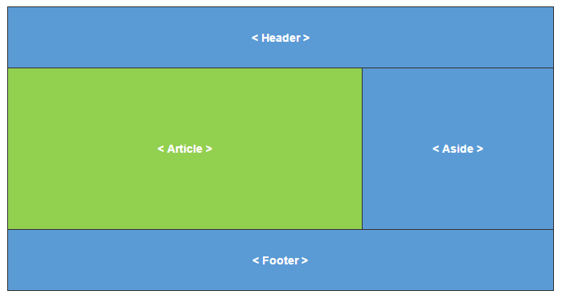
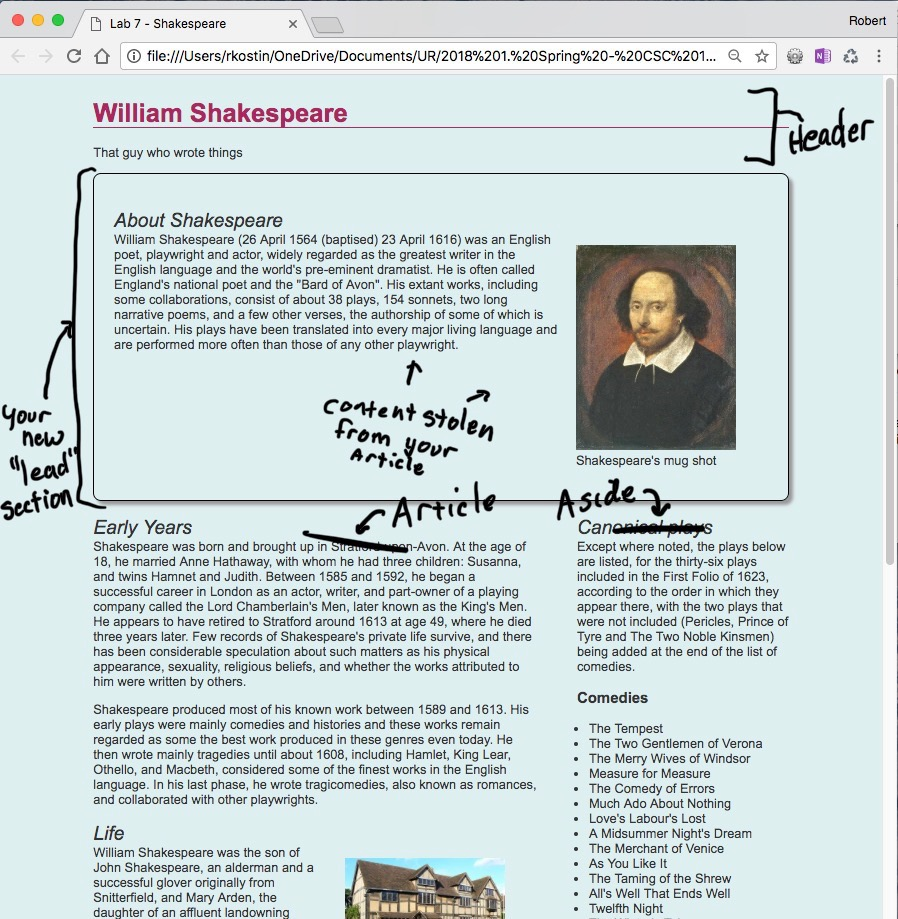
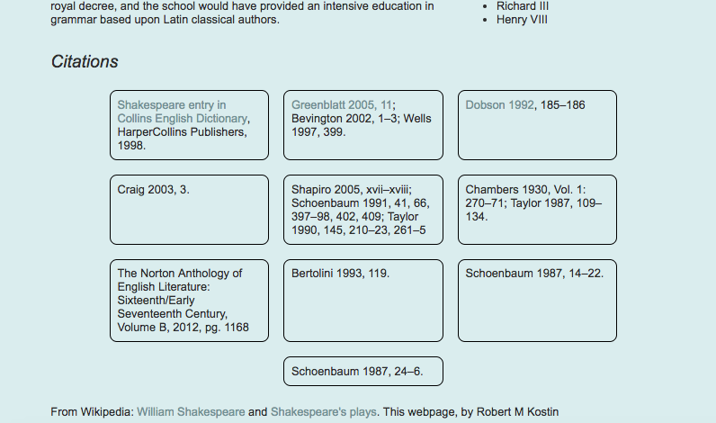

# Lab 7: CSS for Layout
*Due: Wednesday, June 9, 2021*

The purpose of this lab is to add a layout to your lab webpage using the latest layout techniques: **CSS Flex** and **CSS Grid**.  

NOTE: success if this lab assumes you have a structure in your HTML *exactly* like this, with no content in-between the structural elements:

In-between the BODY tags...

```html
 <header>
</header>

<article>
</article>

<aside>
</aside>

<footer>
</footer>
```

...and in the FOOTER, you have a list of citations (or references, or whatever) in a UL:

```html
<h2>Citations</h2>
<ul>
  <li></li>
  <li></li>
  <li></li>
</ul>
```

If for some reason, your content is not in this structure, fix it before going on or things will definitely not work out in this lab.

## Step 1: Make a copy of Lab 6

- Make a copy of all the files in it to a new folder named **lab07**
- Change the TITLE in the HTML to reflect the change to “Lab 7…”

## Step 2: Add a container to constrain the text

- Your document must use a “container” as demonstrated in a recent lecture.  In HTML, just inside the BODY tags add a DIV...

```html
<body>  
<div class="container">

</div><!--.container-->
</body>
```

- And then in CSS,  create a class named ".container" and apply the appropriate styles to make the content "float" so to speak, in the center of the viewport (refer to the CSS Layout lecture slides)
  - Give the container a width of anything between 85 to 95% ...your preference
  - Give the container a max-width of 1000px or so ...your preference

## Step 3: Apply a page layout using CSS Grid

Using the CSS **Grid** layout technique, you will position your HEADER, ARTICLE, ASIDE, and FOOTER elements into a classic "c-clamp" layout using CSS Grid Layout properties



- All four structural elements in your webpage must be positioned using GRID properties.

To implement a layout using CSS Grid, you'll need to add the grid styles in your CSS.  These styles must target *the one HTML element that directly contains* all the structural elements - in this case you're targeting your HEADER, ARTICLE, ASIDE, and FOOTER.  The style that does this is already there!  It's your  `.container{ }` style.

In your CSS, **add** these properties to your `.container` style...


```html
display: grid;
grid-template-columns: 2fr 1fr;
```

At first, the layout will look wrong until you apply the next step which is to tell the HEADER and FOOTER to span from lines 1 through 3.  

- Required: use a **group selector** to apply the following style to both the HEADER and FOOTER at the same time.  (Yes - you might have to look at your notes from a previous lecture on how to create a *grouped* selector.)

Then add this property to that selector...

```html
	grid-column: 1 / 3;
```

At this point, the layout should look correct *except* you need to fix the readability problem created by putting the ARTICLE and ASIDE side-by-side.  

- Hint: add *elbow room* (i.e. margin and/or padding) to just the elements that need the extra space, on just the sides that need it


## Step 4: Create a new "Lead" section

- In the HTML, create a new structural element **between the HEADER and ARTICLE**: use a `<section>` element and put a class on it.  A class name of `"lead"` would make sense.
- *Move* some content from your ARTICLE to the "lead" section.  Suggestion: your first H2, FIGURE, and a paragraph.  
  - Cut it from the ARTICLE
  - Paste it into the lead section

Again, the layout will look wrong until you apply the next step.

- In your CSS, set the lead section to span from lines 1 through 3. (Required: add the `.lead` selector to the grouped HEADER and FOOTER selector that has the grid-column property in it.)

Every web developer's goal is to *not* alter your original HTML document. However in this case, depending on how you setup your content originally in your ARTICLE and ASIDE **you may need to *move* some content around to balance the page layout**. (Normally you would never do that, but for these lab assignments it's okay.)  Try and get the content in the ARTICLE and ASIDE to somewhat line-up equally, side-by-side ...make it look balanced.

## Step 5: Style the "Lead" section

- Apply styles to your lead section.  Because you created your own styles for Lab 6, exactly what you do next depends on what you did in Lab 6.
  - At the very least, try adding a border around your lead section.  Some size, style, and color that goes with the rest of your page design.
  - Make sure the content within the border doesn't touch the border.  (Add padding.)  And if necessary, margin to move the border away from other content above or below it as you see fit.
  - Continue to add styles - keeping in mind that more is better for this assignment.  (Demonstrate that you know how to use all kinds of CSS properties!)  However, keep in mind whatever you do, the content still needs to be readable.

Here is an example, albeit a boring one, of what your lab might look like, except using your content (and hopefully a far more interesting set of styles):



## Step 6: Apply a Flex layout to your citations

- Assuming you used an unordered list for your citations (or references or whatever you called them), add a class to the UL.  For example, add: `"flowing-boxes"` or something like that. 
- Then, in CSS add the following styles to the class `.flowing-boxes`:

```css
display: flex;
justify-content: center;
flex-wrap: wrap;
padding-left: 0;
```

You can play around with some of the styles above.  Google `css justify-content` or `css flex-wrap`, and read-up on the options you have.  Try some of the other values to see what they do.

- Then, create a new style in your CSS using a descendent selector targeting the LIs inside the new class - something like this: `.flowing-boxes li` and add these declarations:

```css
flex-basis: 200px;
list-style-type: none;
```

Here too you can play around with the `flex-basis` property.  Google it.  Also look into `flex-shrink` and `flex-grow`.

- Add more declarations to the class above to style it in a way that fits with your webpage's style.  At the very least, you should probably add all the properties of the box model (border, margin, and padding).  And then add some other styles, like border-radius and maybe a background color …it's up to you.

Here's another example of what your webpage should look like at this stage (but yours should be better using more CSS properties):



## Step 7: Upload your work

When you are done with your webpage, close everything and use your FTP software to access your account on **csc170.org** and upload your files:

- In a web browser (any), go to this address to check your handiwork: <br>**www.csc170.org/accountname/lab07/start.html**<br>(where “*accountname*” is your account name)

## Step 8: Report your work

Remember: Use the W3C HTML validator (**http://validator.w3.org**) AND the W3C CSS validator (**http://jigsaw.w3.org/css-validator**) to check your work before you report it!

- In our Blackboard section, in Lab 7, post a link to your webpage to receive credit for this Lab.