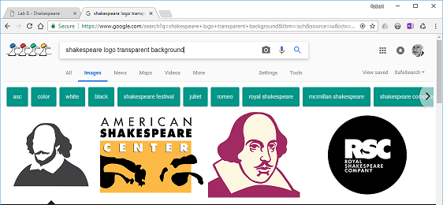
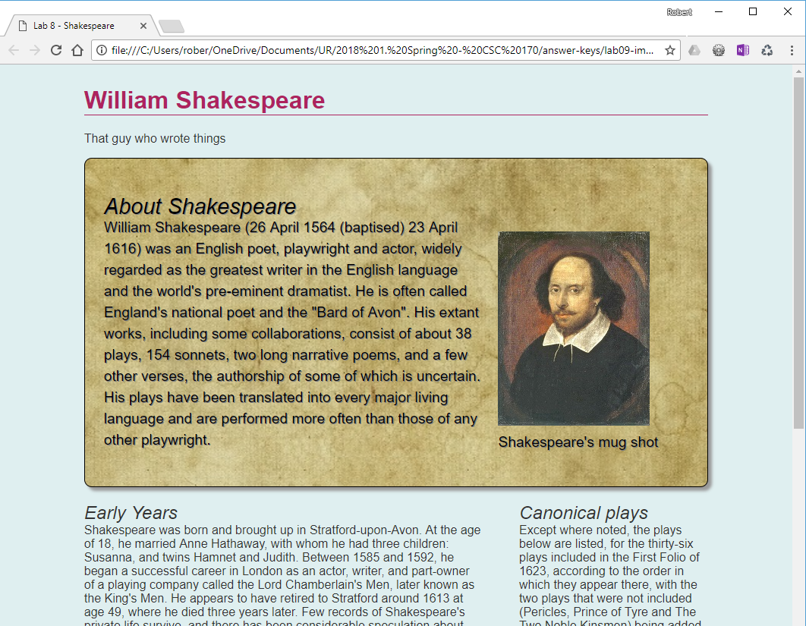
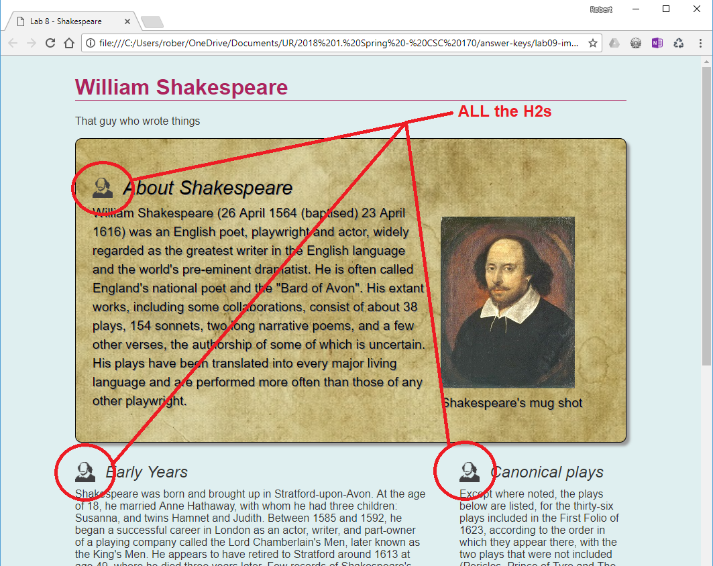

# Lab 9: Images for the Web
*Due: Wednesday, June 16, 2021*

In this lab, you'll work on your **start.html** file which was left out of the menu system you built in Lab 8.  That's okay - we'll fix the menu in another lab, later.  For now, just focus on the start.html file.

## Step 1: Prepare images to use as background images in your website

In this step you'll need to find and prepare two images: one for use as stylized bullets for your H2s (like the professor demo'd in lecture); and another for use as a background image

### Find or create a small logo image to use on your H2s

- The image must be about something related to the content in your lab assignments

- The image must be the appropriate file type - it must be a type that popular web browsers support

Suggestion: Google something like "________________________ logo" example:  `shakespeare logo`

 ...then drag the image to your computer's desktop and rename it.

- The image must be very small - about 40 pixels square (or squarish)

  - Most likely you'll find a good image but it will be too big.  Use software on your PC or Mac to resize it.

Here is a result, after renaming to **logo.png** and resizing it to 36x36 pixels: 

### Find or create a background image to use on your *.lead* section

- The image must be appropriate for use as a background image, i.e. something that still makes sense if it's aspect ratio is distorted.  Examples include clouds, landscapes, flowers, stuff like that.  Also, the image needs to be somewhat related to the content in your lab assignments.
- The image must be the appropriate file type - it must be a type that compresses very well
- A background image (or any image being used on the web) must have a small file size, else you will lose points for that!
- The image will be used as a background - behind text, so it must be *very* low contrast.  
- If your background image is to contrasty and your text becomes unreadable you will lose points for that too!
- Using a picture editing program to lower the contrast if necessary - perhaps turn it into grayscale if that helps.
- Suggestion: Google something like "background pattern _________________________ low contrast" example:  `background pattern parchment low contrast` (*parchment paper* is related to Shakespeare)

- The image must be around 500 - 600 pixels wide

  - Use software to resize it.  Make sure the files size of the end result is *less than* say about 200 KB.

Here is an example: *parchment paper*.  It is low contrast and this file has been *resampled* so it's only 101 KB.  This is a good example of a background image.

  

## Step 2: Setup the Files

NOTE: for this lab, you're only going to edit the **start.html** file - *not* four smaller webpages you created in Lab 8.  Don't delete those other files - just let them ride-along in the file system for this lab.

- Make a copy of Lab 8, rename the folder lab09
- Put your two new background images (the one for the H2s and the one for the background) in the **images** folder
- In the  **start.html** file, delete the LINK tag that connects to the navigation.css file

  - Notice: you're *not* deleting the actual navigation.css file!  Leave that as-is in the css folder.
- Also in the **start.html** file, and delete the NAV element and all its contents.

## Step 3: Add the Background Image to the .lead element

Code to do the following was demo'd by the professor in the lecture on images.  Refer to your notes. 

For the following steps, you'll need to edit the **styles.css** file in the **css** folder:

- Edit the ***.lead*** style.  Add the background image using the `background-image` property to add the image intended for the .lead element
  - Remember the syntax for the background-image property; it uses that `url()` value 
  - Also remember the thing about writing a *path* to a *sibling* folder - tricky!
  - NOTE: if you used a background color or gradient on your .lead element, the background-image property supersedes it (covers it up) - that's okay
- Use the **appropriate helper property(s)** to make the background image look right (common problem: the background image repeats in a weird way and makes strange lines/edges in the background) - it's your job to fix that

  - `background-size: cover` or `contain` ...whichever works best
  - ...and/or maybe use `background-repeat: no-repeat` or `repeat-x` or `repeat-y`
  - Google something like: `css background image properties` to learn about all the ways you can style background images
- **Fix readability issues!**  Chances are, your background images makes the text hard to read.  You need to change the text in your *.lead* element - do whatever it takes - to make the text easier to read.  
  - Change the text color in the *.lead* element (the easiest fix)
  - Try making the font **bold** if that helps
  - Add a text shadow (but don't go nuts)
  - Increase the line height
  ...do all these things and more

You might want to try light - or white text - instead of dark text (color), depending on your background.

...which still isn't great, but at least it's readable.

## Step 4: Add the Background Image to the H2s

Code to do the following was demo'd by the professor in the lecture on images.  Refer to your notes.

- Edit the **styles.css** file in the **css** folder - edit the *h2* style - add the small logo image as a background image using the `background-image` property
  - Remember the syntax for the background-image property; it uses that `url()` value thing
  - Also remember the thing about writing a *path* to a *sibling* folder - tricky!
  - Turn off the "repeat" using the `background-repeat` property  
  - Position the logo image up, down, left or right as necessary using the  `background-position` property so it lines-up nicely with the H2 text (Hint: the value: "center left" is a good place to start)
- Add other styles as necessary to line-up the image
  - Hint: you may need to add padding, all the way around your H2 to make the image fit and/or use the  `background-size` property to tweak the size of the image (but be careful not to distort it!)
- Use some padding on the left to move the text away from the left side of the H2's edge (border) so the text does not sit on top of the logo

You should end up with something like this...

## Step 5: Upload and report your work

- When you are done, close everything and use an FTP tool to access your account on csc170.org and upload your **lab09** folder:
  - In a web browser (any), go to this address to check your handiwork: `www.csc170.org/accountname/lab09/start.html` (where “accountname” is your account name)
- Remember: Use the W3C HTML validator (`validator.w3.org`) AND the W3C CSS validator (`jigsaw.w3.org/css-validator`) to check your work before you report it!
- In our CSC 170 Blackboard section, in Lab 9, post a link to your webpage to receive credit for this Lab.