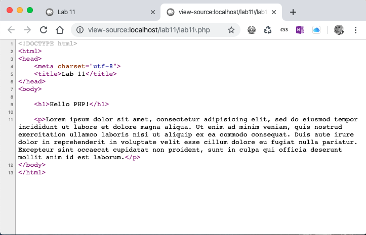

# Lab 10: Localhost
*Due: Wednesday, June 16, 2021 ...same day!*

The point of this lab is to simply demonstrate that you can setup and work with a "localhost" on your own computer. 

1. RECOMMENDED: Install a "web stack" like **MAMP** or **MAMP for Windows** on your own computer
2. Alternatively: use **MAMP for Windows** which is installed on the computers in any of the labs on campus (available via the UR Virtual Desktop: [desktop.rochester.edu](https://desktop.rochester.edu/))
3. BACKUP OPTION: Work blindly on your own computer and then FTP (upload) your files to the class web server to check if they're working correctly

Regarding installation of the software: **MAMP** or **MAMP for Windows**:

- You can use <u>any</u> web stack available in the industry today, not just *MAMP* or *MAMP for Windows*, but the Professor and TAs are most familiar with the *MAMP* products.
- If you can't get any web stack to work on your own computer, no matter.  The back-up option (#3, above) is what you can use for the rest of the semester.

*NOTE: Some of you are already working with your localhost successfully on your own computer. If so, you can jump to **Step 3: Create a Demonstration***

## Step 1: Installation

If you are okay installing a software on your personal computer (recommended):

- Pick a WAMP or MAMP (or LAMP?) software bundle - options were presented in the recent lecture
  - Recommended: [mamp.info](https://www.mamp.info/) ...but be sure to avoid "MAMP Pro"
- Download and install the software onto your computer

*Note: the following step assume you installed **MAMP** or **MAMP for Windows**. If you're using a different stack, you can still complete this lab. Jump to **Step 3: Create a Demonstration***

## Step 2: Launch and Configure the Software

*This step applies to MAMP or MAMP for Windows only. If you're using some other web stack, jump to Step 3.* 

- Start the **MAMP** or **MAMP for Windows** application
- **Recommended (both Windows and Mac):** make these changes in *Preferences*
  - *NOTE: the interface for MAMP and MAMP for Windows has changed recently; the images below represent an earlier version ...sorry*


*(Most important: make sure the Apache port is set to **80**)*

*(If you keep all your CSC 170 lab files in a particular folder, set the "path" there!)*

After you've made the suggested changes to the Preferences, above, continue...

- In the file system of your computer find and open a window to the directory (folder) of the "document root" (sometimes called the "web root")
  - If you followed the suggestion, above, the folder you need to open is simply the place where you keep all your lab files

## Step 3: Create a Demonstration

- In the *document root* in your file system, create a folder named **lab10**, and inside that create an HTML document named **index.php** 

  - Actually, it doesn't matter what the filename is so long as the file extension ends with **.php**

- Add a normal HTML5 document structure (doctype etc.) to the file

- In the BODY tag, add some content - not much, just something like an H1 or something like this: `<h1>Hello PHP!</h1>`

- Under your little bit of content in the BODY tag, enter a "PHP Include" statement like this: 

  ```php+HTML
  <?php include "content.php"; ?>
  ```

  NOTE: the filename "content" can be whatever you want

- Then create another file in the same folder; name the file **content.php** (or whatever you used in the *include* statement above)

  - Do **not** fill this other file with an HTML5 document structure! Start with it blank

- In the new file, add some plain text - lorem ipsum or whatever
  
  - You can use whatever HTML tags you want - like a P tag to wrap around your lorem ipsum text ...whatever makes sense
  
- Save and close your files

Then check your handiwork in your web browser.  Go to the URL: **localhost**

- **Mac users:** if you get the  "Forbidden" message when opening your localhost in your web browser, post a message in our #help channel in Slack.  We don't know why that's happening, but the TAs and I will work with you in Slack to try and figure that out.

- Navigate to your webpage (the first file you created) and you should see something like this:


You should see both the HTML page with the H1 **and** the lorem ipsum text from the "included" file

If you just see the H1 **or** just the lorem ipsum text, then you did it wrong.  Go back and figure it out and/or use our #help channel in Slack.

- One more thing: open the *source view* of that webpage.  Notice that you'll see *no* PHP code!  You'll just see the combined HTML code like this...



...that's important to remember!  The server (in this case, your computer) **compiles** the PHP code and performs the *Include* process <u>before</u> the page is served to the web browser (in a millisecond).  

## Step 4: Get Credit

- Arrange your document root folder and your web browser side-by-side on your computer desktop - something like this:


*Make sure the **path of your folder**, **the two files**, and **the URL** in the web browser is clearly visible in the image*

- **Take a screenshot** of your desktop and save the image (JPG, PNG ...it doesn't matter)
- In our CSC 170 Blackboard section, in Lab 10, **upload the image file** of your desktop to receive credit for this Lab.

