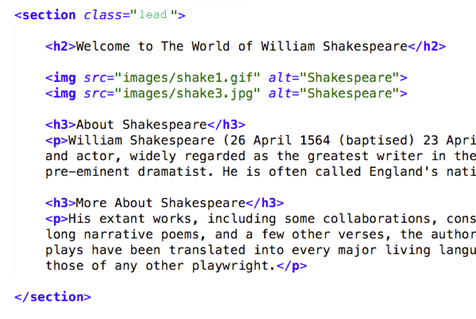
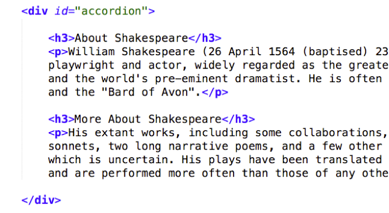

# Lab 15: JavaScript Plugins
*Due: Monday, June 28, 2021 (beware: overlaps with Lab 16)*

The goal of this lab assignment is to rip-out the simple JavaScript solutions you used on the homepage of your website and replace them with more elegant, jQuery-powered plugins.

The plug-ins we'll be using are: 

- **Super Simple Slider**
- **jQuery UI**


## Setup - Rip-out the Old JavaScript

- [ ] Make a copy of your **lab14** folder.  Call it **lab15**

- [ ] In the PHP Include file where you keep the HEAD (**html-top.inc**), change the TITLE in the HEAD  to "Lab 15 - ..."  e.g.  `<title>Lab 15 - Shakespeare</title>` 

- [ ] In the **index.php** file rip out the "hover trick" JavaScript you used from Lab 14 by doing this...
  - Take the IMG element out of its FIGURE element - delete the FIGURE and FIGCAPTION elements.  Just leave the IMG under the H2, by itself.
  - Remove the *onmouseover=""* and *onmouseout=""* attributes from the IMG
  - Create a second IMG element, right under the first, that points to your other image.  (The one you used for your *onmouseover*.)

- [ ] Rip out the "More..." JavaScript you used from Lab 14 by doing this...
  -	Remove the IDs you used to toggle the content
  -	Delete the BUTTON element between your two DIVs
  -	Delete the DIVs around your content (leave the content)
  -	In the index file, delete the script link to the **js/scripts.js** file
  -	In the file system, delete the folder and file: **js/scripts.js**

You'll end up with something that looks like this:


## Install Super Simple Slider
You need to install the plugin according to the instructions by the author.  In all, you need to do the following:
- Normally, you would download the plugin files from the author's website.  Instead, download this prepared set of files: [sss.zip](sss.zip)

- Extract the **sss** folder from the ZIP file and add the folder *as-is* to the **lab15** folder

  - Note: the author of this plugin decided to put his CSS and images all inside his own "sss" folder - not your JS folder or CSS folder.  That's the way he wrote it, so you have to roll with it!

- In the PHP Include file where you keep the HEAD, in the correct location add a link to the **sss/sss.css** file
  `<link rel="stylesheet" href="sss/sss.css">`

- In the **index** file wrap your two IMGs in a new DIV with a `class="slider"`

- In the **index** file, in the correct location for installing a SCRIPT element, install the jQuery CDN (from Google)
  `<script src="http://ajax.googleapis.com/ajax/libs/jquery/1.9.0/jquery.min.js"></script>`

- In the **index** file, in the correct location install the SSS plugin `<script src="sss/sss.js"></script>`

  - Note: the SSS plugin is dependent on jQuery so make sure you install it in the right place!

- In the **index** file, in the correct location install an initialization string for the SSS plugin

  ```html
  <script>
  $('.slider').sss();
  </script>
  ```

Look at your index file in a web browser (probably need to use your localhost because it's a PHP file).  The two images should automatically start "sliding."  If not, you need to fix it before moving on.

*Note: if you want to add more pictures to your slide show, you can do that.  Just make all the images have the same dimensions.  It works better that way.  (You'll see.)*

## Install jQuery UI's Accordion Plugin

You need to install the plugin according to the instructions by the developers of jQuery UI.  In all, you need to do the following:

- NOTE: you must *not* re-install jQuery!  (You already installed it when you added SSS.)

- In the **index** file, in the correct location install the plugin script using a CDN that hosts the jQuery UI script

  ```html
  <script src="http://code.jquery.com/ui/1.11.4/jquery-ui.js"></script>
  ```

  - Note: the plugin jQuery UI is dependent on jQuery so make sure you install it in the right place!

- In the **index** file, in the correct location install an initialization string for the jQuery UI plugin

  ```html
  <script>
  $( "#accordion" ).accordion();
  </script>
  ```
  
  *Note: if you want to use some of the accordion options in the initialization script, go ahead.*

- In the PHP Include file where you keep the HEAD, install the CSS using the CDN that hosts the jQuery UI styles
  `<link rel="stylesheet" href="http://code.jquery.com/ui/1.11.4/themes/smoothness/jquery-ui.css">`

- Wrap your content (a couple of headers and some paragraphs) in a new DIV with an `id="accordion"`

You should end up with something that looks like this:


Note: The jQuery UI widget, *Accordion*, requires that HTML elements be grouped in pairs.  

1. The first element (the header) will be put on the accordion bar
2. The following element will be put inside the expanding accordion. 

IF you want more than one element to appear inside the expanding accordion, wrap the elements in a DIV so you still end up with pairs: a heading, and then an element; and then a heading, and then an element; et cetera.

## Fix Layout Issues

Depending on how you styled your "lead" section with your custom CSS you may or may not have some display problems.  IF you are seeing a very large slide show (the SSS plugin) with your Accordion below it, follow these instructions.

- Add a the "full-width" class to the H2 in your "lead" section<br>`<h2 class="full-width">Welcome to The World of William Shakespeare</h2>`<br>*That's a class we created earlier to have any element span across multiple grid columns*
- Add a new class to the "lead" section named "inner-container" (we'll create the actual style for that later)<br>`<section class="lead inner-container">`<br>*Note: if you had another class in there like "full-width" you can remove it*
- Edit your **html-top.inc** file to add a link to a new CSS file named **css/home.css** (you'll create next)<br>`<link rel="stylesheet" href="css/home.css">`

- Create a new CSS file named **home.css** and put it in your **css** folder

- In the **home.css** file add styles like this to position your SSS slide show and Accordion side-by-side<br>

  ```css
  .inner-container {
  	display: grid;
  	grid-template-columns: 1fr 1fr;
  	grid-gap: 25px;
  }
  ```
  _There are other styles you can add to the **home.css** file, as you see fit_


## Check and Upload your Work

- Validate the HTML file ([http://validator.w3.org/](http://validator.w3.org/))

When you are done with your webpage, close everything and use an FTP tool (to access your account on **csc170.org** and upload your files:

- In a web browser (any), go to this address to check your handiwork: 
	```www.csc170.org/accountname/lab15/index.php```<br>
	(where *accountname* is your account name)

## Report your work
•	In our Blackboard section, in **Lab 15**, post a link to your webpage to receive credit for this Lab. 
