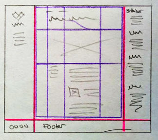

# Project 2: Formatting and Layout

*Due: Monday, June 21, 2021*

In this assignment, you will work with the HTML document you created in Project 1 and style it using CSS. 
The result will be a **formatted document** that uses some version of a **columnar layout**, i.e. some side-by-side content. 

## The HTML Document

- Start with the final version of your HTML document you created for Project 1.  
  - Project 1 and Project 2 will be compared against each other to make sure the content is all there and similar.  Although the *content* from Project 1 has to be in Project 2, the HTML code *may* change in limited ways. Still though, the intent is to leave the Project 1 content as-is, as much as possible.
  - The content must be in one HTML file.  (Do not split your content into multiple HTML files)
  - You can add classes to elements.  For example, you can change a `
` into `
` , or add a `
` as need ...whatever is necessary for styling.
  - IF NEED BE, you can shuffle content around in the HTML document – move blocks of content from one area to another, but only if you really have to.
- The **title** in the `<title>` tag (in the `<head>`) must be updated to say, "**Project 2 -** " followed by your topic, for example: `<title>Project 2 - Marc Andreessen</title>`

Note: although you know how to create *in-page* (jump) links, navigation is *not* required for Project 2

## The CSS document

- You must create an external CSS document and link it from your HTML document. 

- You may not use any inline or embedded CSS styles, or old fashioned HTML attributes that format content in any way.
- You must REMOVE the **border** attribute from the TABLE element you used in Project 1 and write styles for the table so it appears like a data table. Suggestion: in your CSS, target the elements, TABLE, TR, TH, and TD and write styles for them.
- You must clean up your CSS.  There must be no unused CSS statements (selectors or declarations) cluttering up your CSS document.

## Formatting

- The CSS must apply an ample amount of formatting to prove that you know how to style an HTML document using:
  - Fonts (typefaces, font sizes, font weights, and other typography settings)
  - The box model (margins, paddings and various borders)
  - Other embellishments – whatever you can find!  Pseudo-classes, background images and background colors.

- DO NOT USE the code provided from lab assignments as-is.  You can refer to them and learn from them (obviously) but do not use code from the labs in Project 2 without *extreme* customization. 

## Container

- Project 2 must use a “container” to constrain its content in some way and keep it "floated" in the center of the web browser window.  You don’t have to constrain *all* your content (although that’s okay if you do), but you must demonstrate good use of the trick.  
- The goal of a container is to *keep any paragraph* from extending too wide which would be a readability problem.  

## Layout

Required: a **columnar layout** is any layout where some of the content is positioned side-by-side.  

- At some point in your web page, you must **break the normal document flow** and position content side-by-side to create a columnar layout. 

- You may *not* create a simple C-Clamp layout!  You must do better than that. Suggestions...
  - Look at the elements you created in Project 1 and the amount of content in each block.  Look for patterns that might work well for page layout. 
  - Draw a wireframe diagram (on good ol' paper?) before you start trying to code anything.  Then try to replicate the wireframe using an online css grid generator tool (...google it!) 

  

- If need be, you can add/change the structure of Project 1 to achieve a better layout.  It's not preferred, but it is acceptable in CSC 170.  You can also add, swap-out or resize images as needed.
- You can use either of the approved following page layout techniques:
  - **CSS Grid** for two-dimensional positioning of content; best used for overall page layout
  - **CSS Flex** for one-dimensional positioning of elements; best used within a grid layout

_Use of the same layout as demonstrated in the lab assignments (a basic C-Clamp) will lose points._

Note: CSS Floats are okay but *not* for page layout

## Usability and Aesthetics

The webpage appearance must be usable and readable without strain.  Your design (formatting and layout) must have a subjectively pleasant aesthetic. Although artistic capabilities are not being graded, the webpage must not be sloppy.

- We will be very flexible when it comes to judging aesthetics. Only really, *really* ugly or sloppy designs will be penalized (unless you're being ironic, in which case you need to make it clear that you're being so.)

- Proper contrast between foreground and background must be maintained to make the webpage easy to read
- Fonts (type, size, style and color) must be appropriate for desktop viewing. (Don't worry about viewing Project 2 in small viewports - like on a smart phone.  We'll cover that topic later in the semester.)
- Ample use of the box model (margin, padding,borders) to create white space must be used to separate areas of content into clearly delineated sections.

## Location

-  Your one-page web site must be installed on the class web server, within your directory where you’ll create a new folder that must be exactly this: **project2** ...all lower case, spelled exactly like that.
-  The name of the HTML document must be exactly this: **index.html** (not *start*.html this time)
-  The image(s) you use must be in a sub-directory of the **project2** folder named  **images**
-  The CSS documents you use must be in a sub-directory of the **project2** folder named **css**
-  Validate the HTML file (**http://validator.w3.org**)
-  Validate the CSS file (**https://jigsaw.w3.org/css-validator**)

## Report your work

To receive credit for this lab: in our CSC 170 Blackboard section, in the **Lab/Project Turn-in** area, in the **Project 2** assignment, post a link to your webpage. 